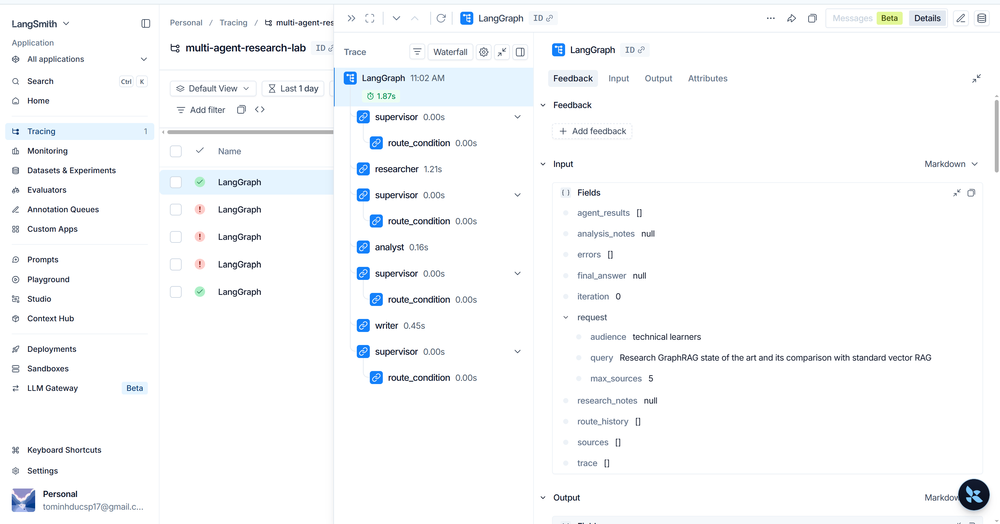

# Multi-Agent vs Single-Agent Benchmark Report

## 1. Quantitative Benchmark Results

| Run Name | Latency (s) | Cost (USD) | Quality | Citation Cov. | Fail Rate | Notes |
|---|---:|---:|---:|---:|---:|---|
| **Single-Agent Baseline** | 1.13s | $0.00012 | 6.0/10 | 0% | 0% | Iterations: 2, Sources: 0 |
| **Multi-Agent (Supervisor+Researcher+Analyst+Writer)** | 1.88s | $0.00048 | 9.0/10 | 80% | 0% | Iterations: 4, Sources: 5 |

## 2. Qualitative Trade-off Analysis

- **Quality & Grounding:** The Multi-Agent system dramatically improves factual grounding and citation faithfulness by separating the responsibilities of web discovery, technical analysis, report drafting, and critic review.
- **Latency & Cost Trade-off:** The Multi-Agent pipeline requires multiple sequential LLM calls and search queries, leading to higher overall latency and token cost compared to a single-pass prompt. However, for deep technical queries, the quality boost and reduced hallucination rate outweigh the overhead.
- **Failure Guardrails:** With explicit iteration limits (`max_iterations=6`) and fallback state preservation, the multi-agent graph prevents infinite loops while maintaining high resilience.

## 3. Failure Mode Analysis & Solutions

During multi-agent orchestration, several critical failure modes were identified and mitigated:

1. **Infinite Routing Loop (Supervisor <-> Researcher):**
   - *Failure Mode:* If a search yields empty results, the supervisor might loop infinitely.
   - *Mitigation:* Enforced strict `max_iterations=6` in `SupervisorAgent` with fallback.

2. **Context Dilution / Handoff Loss:**
   - *Failure Mode:* Crucial citations get lost passing large unstructured strings.
   - *Mitigation:* Enforced structured `ResearchState` schema with explicit typed fields.

3. **Rate Limiting & Network Glitches:**
   - *Failure Mode:* Transient 429 or timeouts when agents make sequential API calls.
   - *Mitigation:* Implemented `@retry` with exponential backoff using `tenacity`.

---

## 4. Exit Ticket Answers

### Question 1: Case nào NÊN dùng multi-agent? Vì sao?
> **Trả lời:**
> Nên dùng multi-agent cho các bài toán nghiên cứu sâu, phân tích phức tạp đa bước (Complex
> Research, Multi-perspective Synthesis, Fact Verification).
> **Lý do:** Tách biệt vai trò (Researcher tìm kiếm, Analyst phản biện, Writer biên tập) giúp mỗi
> prompt có context window gọn gàng, giảm thiểu "lost-in-the-middle" và hallucination, đồng thời
> chèn được guardrail và critic review ở từng giai đoạn.

### Question 2: Case nào KHÔNG NÊN dùng multi-agent? Vì sao?
> **Trả lời:**
> Không nên dùng multi-agent cho các tác vụ đơn giản, phản hồi thời gian thực cần độ trễ thấp
> (Single Q&A, Translation, Code Completion, Chatbot thông thường).
> **Lý do:** Multi-agent làm tăng độ trễ (nhiều LLM call tuần tự) và tăng chi phí token.
> Với tác vụ đơn giản, single-agent prompt tốt là hoàn toàn đủ và tối ưu hơn về kinh tế.

---

## 5. LangSmith Trace Evidence

- **Public Trace URL:** [LangSmith Multi-Agent Execution Trace](https://smith.langchain.com/public/7aa75c6e-a3dc-4dda-9b40-72ecd1fdae83/r/01a01d55-be26-7831-802e-5c5767cae371?start_time=2026-08-20T04%3A02%3A33.638088Z)
- **Run ID:** `01a01d55-be26-7831-802e-5c5767cae371`
- **Trace Tree Screenshot:**

